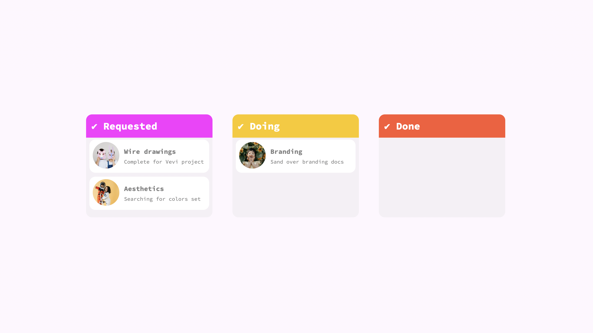
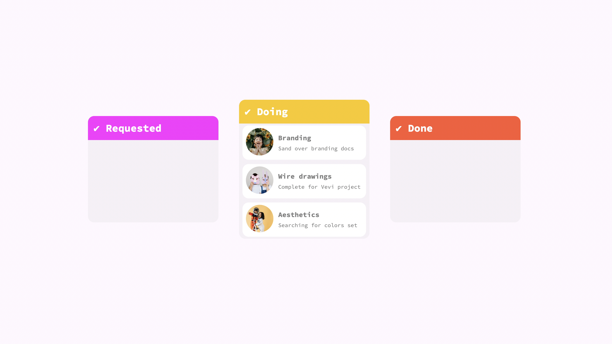

#  📚 TO DO list! 📚

## 👛 What's it about?

Using drag events I tried creating 3 lists with tasks, that should have been done "by yesterday"

## 👛 First look 

Solid first list

and then we can grab individual task

## 👛 Technologies

+ HTML 5
+ CSS 3
+ JavaScript

## 👛 Inspiration
This small project is part of an amazing Full Stack Developer Course created by  ♥ Ania Kubow ♥. Love this women, her sense of humor and ability to explain hard, code-things in a way that I finally understand. 🏆
You can check this course [here](https://www.codewithania.com/about) and I absolutely encourage You to visit her [YouTube](https://www.youtube.com/@AniaKubow) channel 💕.
